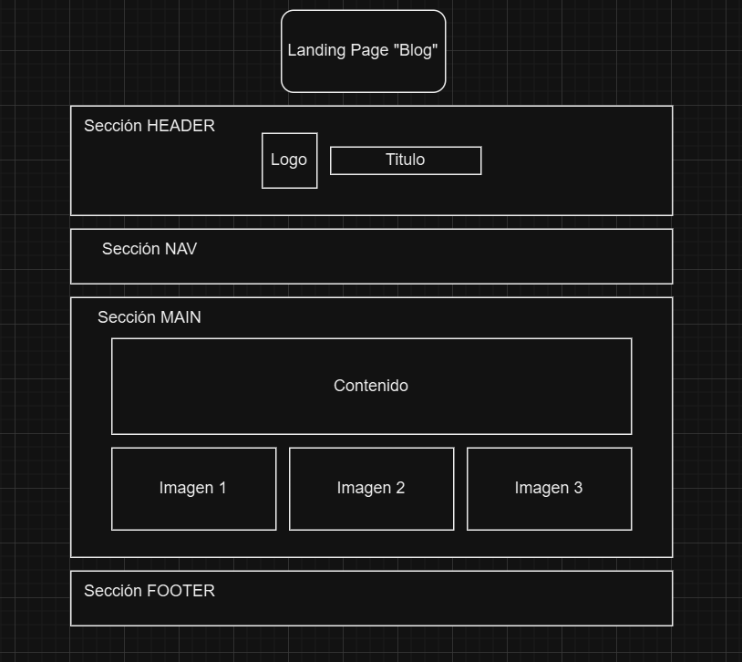

# Módulo 3 - Proyecto 3
## ¡Bienvenidos al proyecto "Landing Page"!

## Tabla de Contenidos
* [1. Desafío](#1-Desafío)
* [2. Diseño de prototipado](#2-Diseño-de-prototipado)
* [3. Desarrollo de proyecto](#3-Desarrollo-de-proyecto)
* [4. Conclusiones](#4-Conclusiones)

****
## Desarrollo

### 1. Desafio
 Para este tercer proyecto se solicita crear un lansing page, que muestre productos y/o servicios. Se debe considerar las siguientes habilidades y conocimientos:
- Prototipado simple
- Etiquetas estándar HTML5
- CSS, del cual se puede seleccionar:
    a) Archivo index.css que incluya los estilos.
    b) Archivo HTML con los estilos incluidos en el mismo archivo con la estiqueta .
    c) Usar un framework como TailwindCSS, Bootstrap o Bulma, que permita ejecutar clases CSS eficientemente.
  
Y los requisitos y entregables esperados, para UI, se detallan a continuación:
- Desarrollo de prototipado simple
- Aplicar HTML5 en todo el sitio
- Aplicar estilos CSS
- Incluir secciones (Header, Main, Section, Footer)
- A modo opcional, Responsive Web Design (Mobile First Design con media queries)
  
  ****
  
### 2. Diseño de prototipado
 En base al desafío planteado, se realiza el diseño del prototipado del landing page con un formato simple en draw.io. Para este caso se parte con la premisa de considerar como eje central la propuesta de un Blog de viajes. A continuación se muestra el diagrama del prototipado como estructura inicial para su posterior desarrollo de código en HTML y CSS.
  

****

### 3. Desarrollo de proyecto
 Se establecen las etiquetas de base en HTML, y adicionalmente al inicio se aplican los links que permitan el funcionamiento de elementos que se aplicarán más adelante en el código.
 
 
 
 Dentro de esa función se incluye un objeto que almacene resultados, el cual inicia con valor "0", en espera de recibir las respuestas. Posteriormente se agrega "return" para que devolvuelva un objeto conteniendo pregunta, respuestas y resultados. Adicionalmente se incluye una función de "votar" para registrar los votos de la encuesta.

 Para que el usuario pueda ingresar encuestas, se habilita una función, considerando un número de preguntas como base mínimo, adicionalmente se le solicita al usuario que ingrese las respuestas posibles por separado. Para proceder con el registro de las respuestas, se agrega el método push para que permita modificar el array de "respuestas", agregando un nuevo elemento al final del mismo.
 Posteriormente se utiliza la función de crearEncuesta para crear una encuesta, luego se agrega una encuesta nueva al arreglo de encuesta, y una vez realizado esto, se indica al usuario que está votando en la encuesta que está ingresando. Al final el bucle, se retornará el arreglo de "encuestas" con la data ingresada en las nuevas encuestas.

 

 Se procede con la función de votar, con el fin de que los usuarios puedan seleccionar la respuesta, votando por una opción en la encuesta creada:
  
 ---> Incluir imagenes del proyecto 

 
*[Se incluye Link para visualización del Código](./Codigo)*
  
  ****
  
  ### 5. Conclusiones
 Para la preparación del landing page, se dio inicio con la estructura base, tomando como guía las etiquetas....(en desarrollo)
  ****
*¡Gracias!*

